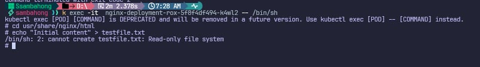
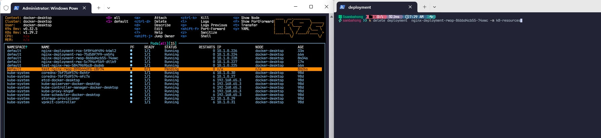

# Access Mode

## ReadWriteOnce

## ReadOnlyMany

## ReadWriteMany

## ReadWriteOncePod
- **Before**
  
- **After**
  

# CLI:

- **Access to container using this command:** `kubectl exec -it <nginx-pod-name> -- /bin/sh`
- **Delete all PVs and PVCs:** 
  - `kubectl delete pvc --all --all-namespaces`
  - `kubectl delete pv --all`

# TODOs:
- [ ]: Create new Nodes for Test ReadWriteOnce access
- [ ]: Add image Evidence to ReadWriteOnce mode